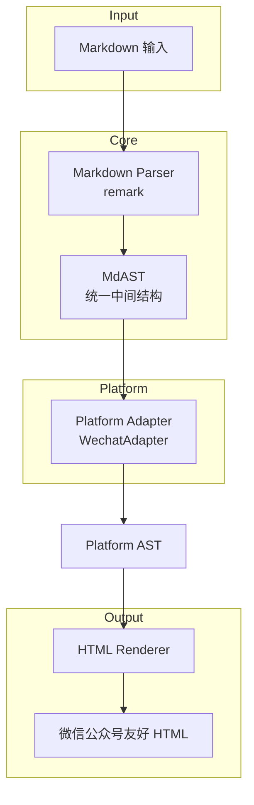
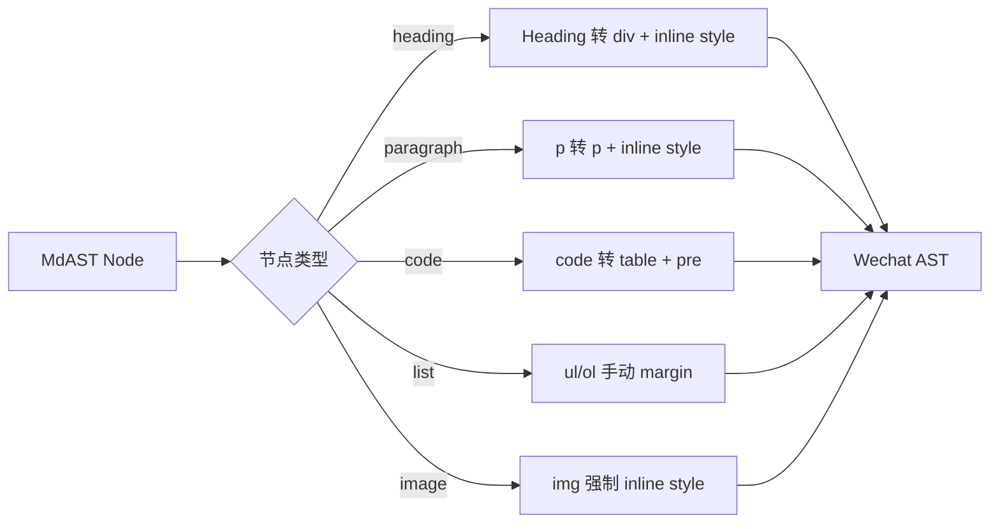

下面按你的要求，**完成 1）架构 mermaid 图 + 2）最小可运行技术骨架**。
内容偏工程化，便于你直接评审或落地。

---

## 一、整体架构图（Mermaid）

### 1. 总体分层架构



**设计要点说明**

* **MdAST 是唯一中间态**：避免 Markdown → HTML 强耦合
* 平台差异全部收敛在 `Platform Adapter`
* Renderer 只关心「结构 + 样式模板」

---

### 2. 微信公众号 Adapter 内部逻辑



---

## 二、最小可运行技术骨架（Node.js）

目标：

> **Markdown → 微信公众号可粘贴 HTML**

### 1. 项目结构（MVP）

```text
md2wechat/
├── package.json
├── src/
│   ├── index.ts              # 入口
│   ├── parser/
│   │   └── markdown.ts       # Markdown → MdAST
│   ├── adapter/
│   │   └── wechat.ts         # MdAST → Wechat AST
│   ├── renderer/
│   │   └── html.ts           # AST → HTML
│   └── theme/
│       └── wechat-default.ts # 样式模板
```

---

### 2. Markdown 解析（parser/markdown.ts）

```ts
import { unified } from 'unified'
import remarkParse from 'remark-parse'

export function parseMarkdown(markdown: string) {
  return unified()
    .use(remarkParse)
    .parse(markdown)
}
```

输出即 **标准 MdAST**。

---

### 3. 微信 Adapter（adapter/wechat.ts）

```ts
export function wechatAdapter(mdast: any) {
  function transform(node: any): any {
    switch (node.type) {
      case 'heading':
        return {
          type: 'div',
          tag: 'div',
          level: node.depth,
          children: node.children.map(transform)
        }

      case 'paragraph':
        return {
          type: 'p',
          children: node.children.map(transform)
        }

      case 'text':
        return {
          type: 'text',
          value: node.value
        }

      case 'code':
        return {
          type: 'codeblock',
          value: node.value,
          lang: node.lang
        }

      default:
        return null
    }
  }

  return {
    type: 'root',
    children: mdast.children
      .map(transform)
      .filter(Boolean)
  }
}
```

**说明**

* 这是「结构转换」，**不涉及 HTML**
* 后续支持平台，只新增 Adapter

---

### 4. HTML Renderer（renderer/html.ts）

```ts
import { theme } from '../theme/wechat-default'

export function renderHTML(ast: any): string {
  function render(node: any): string {
    switch (node.type) {
      case 'root':
        return node.children.map(render).join('')

      case 'div':
        return `<div style="${theme.heading[node.level]}">
          ${node.children.map(render).join('')}
        </div>`

      case 'p':
        return `<p style="${theme.p}">
          ${node.children.map(render).join('')}
        </p>`

      case 'text':
        return node.value

      case 'codeblock':
        return `
<table style="${theme.codeTable}">
<tr><td>
<pre style="${theme.codePre}">${escapeHtml(node.value)}</pre>
</td></tr>
</table>
        `
    }
  }

  return render(ast)
}

function escapeHtml(str: string) {
  return str.replace(/[&<>"']/g, s => ({
    '&': '&amp;',
    '<': '&lt;',
    '>': '&gt;',
    '"': '&quot;',
    "'": '&#39;'
  }[s]!))
}
```

---

### 5. 样式模板（theme/wechat-default.ts）

```ts
export const theme = {
  p: 'font-size:15px;line-height:1.8;color:#333;margin:12px 0;',
  heading: {
    1: 'font-size:22px;font-weight:600;margin:20px 0;',
    2: 'font-size:18px;font-weight:600;margin:18px 0;',
    3: 'font-size:16px;font-weight:600;margin:16px 0;'
  },
  codeTable: 'width:100%;background:#f6f8fa;border-radius:6px;',
  codePre: 'font-size:13px;line-height:1.6;padding:12px;'
}
```

---

### 6. 入口文件（index.ts）

```ts
import fs from 'fs'
import { parseMarkdown } from './parser/markdown'
import { wechatAdapter } from './adapter/wechat'
import { renderHTML } from './renderer/html'

const markdown = fs.readFileSync('example.md', 'utf-8')

const mdast = parseMarkdown(markdown)
const wechatAst = wechatAdapter(mdast)
const html = renderHTML(wechatAst)

console.log(html)
```

---

## 三、当前骨架的工程价值

* ✅ AST 驱动，非字符串拼接
* ✅ 平台规则隔离（可扩展知乎 / 掘金）
* ✅ 微信公众号真实可用（inline style）
* ✅ 适合 CLI / Web / API 三种形态

---

## 四、下一步可直接推进的方向（不展开）

* 增加 table / list / blockquote
* 抽象 `PlatformAdapter` 接口
* 引入配置化主题（JSON）
* 加一个 Web UI（Monaco + Preview）


