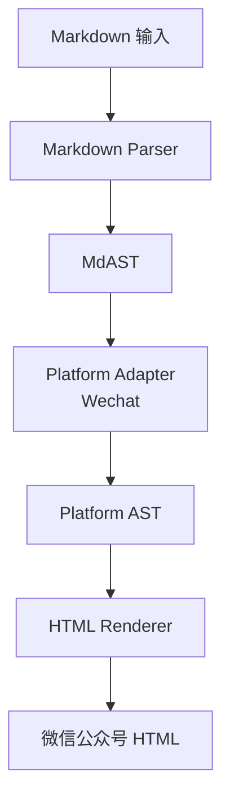

# Markdown 转微信公众号 HTML 技术方案（评审版）

## 1. 项目背景与目标

在内容生产过程中，Markdown 已成为技术写作和知识沉淀的事实标准。但微信公众号等内容平台对 HTML / CSS 的支持存在明显限制，导致：

* Markdown 直接转 HTML 后不可用或样式错乱
* 人工二次排版成本高、不可复用
* 难以支撑 AI 内容生成后的自动化发布流程

**本项目目标**是构建一个：

> 将标准 Markdown 转换为「微信公众号可直接粘贴、样式稳定」HTML 的技术组件，并具备向多平台扩展的能力。

---

## 2. 设计原则

1. **平台优先，而非标准优先**
   以目标平台（微信公众号）的可用性为第一优先级，而非追求语义或 Web 标准的完整性。

2. **AST 驱动，而非字符串替换**
   所有转换基于结构化 AST，避免正则或字符串拼接带来的不可控问题。

3. **平台差异隔离**
   不同内容平台的差异通过 Adapter 层收敛，避免核心逻辑膨胀。

4. **样式内联（Inline Style）**
   适配微信公众号的 CSS 限制，所有样式以内联方式输出。

---

## 3. 整体架构设计

### 3.1 架构概览

系统采用分层架构，从 Markdown 到 HTML 依次经过：

* Markdown 解析层
* AST 中间表示层
* 平台适配层
* HTML 渲染层



---

## 4. 核心模块设计

### 4.1 Markdown 解析层

**职责**

* 解析标准 Markdown
* 输出统一的 MdAST（Markdown Abstract Syntax Tree）

**设计说明**

* 使用成熟解析器，避免自行实现语法
* 该层不引入任何平台相关逻辑

**输入 / 输出**

* 输入：Markdown 字符串
* 输出：MdAST

---

### 4.2 平台适配层（Wechat Adapter）

**职责**

* 将 MdAST 转换为平台可识别的结构 AST
* 解决微信公众号不支持或弱支持的语义结构

**典型规则示例**

| Markdown 元素 | 微信适配策略               |
| ----------- | -------------------- |
| heading     | 转 div + inline style |
| paragraph   | 保留 p 标签，强制样式         |
| code block  | table + pre 结构       |
| table       | 转 div 模拟表格           |
| image       | img + inline width   |

**设计要点**

* 仅做结构转换，不生成 HTML
* 为后续多平台扩展预留 Adapter 接口

---

### 4.3 HTML 渲染层

**职责**

* 将 Platform AST 渲染为 HTML 字符串
* 应用主题样式并内联输出

**关键约束**

* 不输出 `<style>`、`<script>`
* 不依赖外部 CSS
* 控制标签白名单，避免平台清洗

---

### 4.4 样式主题系统

**目标**

* 支持多套公众号排版风格
* 样式配置与逻辑解耦

**形式示例**

```json
{
  "p": "font-size:15px;line-height:1.8;",
  "h2": "font-size:18px;font-weight:600;"
}
```

---

## 5. 技术选型

| 模块          | 技术方案               | 说明             |
| ----------- | ------------------ | -------------- |
| 运行环境        | Node.js            | 生态成熟，适合 AST 操作 |
| Markdown 解析 | remark / unified   | 标准 MdAST       |
| 渲染方式        | 自定义 Renderer       | 精确控制 HTML      |
| 输出形式        | HTML（inline style） | 适配公众号限制        |

---

## 6. 关键难点与应对策略

### 6.1 微信公众号 CSS 支持受限

**问题**

* 不支持大部分现代 CSS
* 粘贴时存在二次清洗

**策略**

* 全量 inline style
* 使用 table / div 等稳定结构
* 黑名单驱动调优

---

### 6.2 代码块与表格展示

**问题**

* 原生 `<pre><code>` 易溢出
* table 样式不稳定

**策略**

* code block 使用 table + pre 包裹
* 表格转 div 模拟布局

---

## 7. MVP 范围定义

### 7.1 MVP v0.1

**支持能力**

* 标题（h1–h3）
* 段落
* 列表（基础）
* 代码块
* 图片

**交付形式**

* CLI 或 Web 页面
* 一键复制 HTML

---

### 7.2 后续演进方向

* 多平台 Adapter（知乎 / 掘金）
* CLI 工具化
* API 化，支持 AI 内容生产链路
* 样式市场 / 模板配置化

---

## 8. 项目定位总结

本项目并非通用 Markdown 转 HTML 工具，而是：

> 一个面向内容平台的「结构化内容适配与渲染引擎」，为人工写作和 AI 内容生产提供稳定的发布基础设施。
